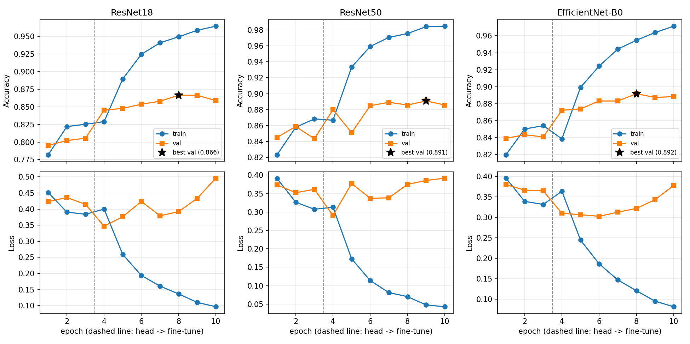

# Structural Damage Identification

**Image-based structural damage classification (Damaged vs Undamaged) using classical ML baselines and transfer-learned CNNs**

| | |
|---|---|
| **Course** | UE24CS352A – Machine Learning |
| **Section** | C |
| **Team** | 16 |
| **Project No.** | 31 |
| **Institution** | PES University |

## Team Members

| Name | SRN |
|---|---|
| Dhruva Myakeri | PES1UG24CS156 |
| Navya Suresh | PES1UG24CS904 |

---

## 1. Problem Statement

Manual inspection of buildings and bridges is slow, costly and subjective. This project classifies a photograph of a structure as **Damaged** or **Undamaged**, and compares classical ML models trained on raw-pixel thumbnails against pretrained CNNs fine-tuned end to end. Grad-CAM is used to check what the CNNs actually look at, and a web UI lets anyone upload a photo and get a prediction.

- **Input:** RGB image, 224×224
- **Output:** `Damaged` (label 0) or `Undamaged` (label 1)

## 2. Dataset

- **Source:** PEER Hub ImageNet (PHI-Net), **Task 2 – Damage State** (binary)
- **Official test set:** 1,460 images (745 Damaged / 715 Undamaged)
- **Training set:** official training set, `[N]` images
- **Train/val split:** stratified 90/10 split of the official training set, `seed=42`
- **Storage format:** float32 arrays, BGR, ImageNet channel-mean subtracted (Keras "caffe" preprocessing); `to_rgb01()` in `src/data.py` converts back to RGB in [0, 1]
- **Augmentation (CNNs, train only):** horizontal flip only (chosen as damage-safe)
- **Test discipline:** hyperparameters and best epoch are chosen on validation only; the test set is scored once per model

> The dataset is not in the repo (the training array is ~7 GB). Download it and place it as shown in [Setup](#5-setup).

## 3. Models

Six models are compared. Classical models use **28×28×3 thumbnails** (8×8 block-averaged from 224×224, 2,352 features) with `StandardScaler`. CNNs use ImageNet-pretrained weights and two-phase fine-tuning.

| # | Model | Type | Tuned on validation | Owner |
|---|---|---|---|---|
| 1 | kNN | Classical | k ∈ {1, 5, 11, 21} | Dhruva |
| 2 | SVM (RBF) | Classical | C ∈ {0.1, 1, 10} | Dhruva |
| 3 | ResNet50 | Deep learning | Best epoch by val accuracy | Dhruva |
| 4 | Logistic Regression | Classical | C ∈ {1e-4, 1e-3, 1e-2, 1e-1} | Navya |
| 5 | ResNet18 | Deep learning | Best epoch by val accuracy | Navya |
| 6 | EfficientNet-B0 | Deep learning | Best epoch by val accuracy | Navya |

**Classical training:** pick the best hyperparameter on the validation split, refit on train+val, score the test set once.

**CNN training:** replace the final layer with a 2-class head, then
1. **Head phase:** freeze the backbone, train the head (3 epochs, LR 1e-3)
2. **Fine-tune phase:** unfreeze everything (7 epochs, LR 1e-4)

AdamW, cross-entropy loss, batch size 32. The checkpoint with the best validation accuracy is evaluated on the test set.

## 4. Work Division

Both members own 3 models of matching total complexity (one simple, one medium, one heavy each), plus a share of the supporting code.

| Area | Dhruva Myakeri | Navya Suresh |
|---|---|---|
| Simple model | kNN | Logistic Regression |
| Medium model | SVM (RBF) | ResNet18 |
| Heavy model | ResNet50 | EfficientNet-B0 |
| Supporting code | `src/data.py` (loading, split, preprocessing), `src/demo.py` (CLI demo), `src/export_samples.py` | `src/gradcam.py` (Grad-CAM + error analysis), `src/app.py` (Gradio UI), `src/plots.py` (curves + results table) |
| Analysis & report | Results and discussion for Models 1–3 | Results and discussion for Models 4–6 |

Both members contribute to the final report and presentation.

## 5. Setup

```bash
git clone https://github.com/nav-yeah/Structural-Damage-Identification.git
cd Structural-Damage-Identification

python -m venv .venv
source .venv/bin/activate        # Windows: .venv\Scripts\activate
pip install -r requirements.txt
```

Place the dataset arrays as:

```
data/task2/
├── task2_X_train.npy
├── task2_y_train.npy
├── task2_X_test.npy
└── task2_y_test.npy
```

Sanity-check the data and split:

```bash
python -m src.data
```

## 6. Usage

Run all commands from the repository root.

```bash
# Classical models (kNN, Logistic Regression, SVM) -> results/baselines.json
python -m src.baselines

# CNNs -> results/<model>.pt, <model>_history.json, <model>_test.json
python -m src.train_cnn --model resnet18
python -m src.train_cnn --model resnet50
python -m src.train_cnn --model efficientnet_b0

# Quick smoke test (1 epoch per phase)
python -m src.train_cnn --model resnet18 --epochs_head 1 --epochs_ft 1

# Learning curves + results table
python -m src.plots

# Grad-CAM + error analysis (needs the trained checkpoint)
python -m src.gradcam --model efficientnet_b0

# Demo on test images or your own photos
python -m src.demo --idx 391 449 1232 44
python -m src.demo --image path/to/photo.jpg

# Export sample JPGs for trying the UI
python -m src.export_samples --n 10

# Web UI (http://127.0.0.1:7860)
python -m src.app --model resnet50
```

CNN options: `--epochs_head` (default 3), `--epochs_ft` (default 7), `--batch` (32), `--lr_head` (1e-3), `--lr_ft` (1e-4), `--workers` (0).

## 7. Project Structure

```
Structural-Damage-Identification/
├── src/
│   ├── data.py            # Loading, stratified split, dataset/dataloaders
│   ├── baselines.py       # kNN, Logistic Regression, SVM on thumbnails
│   ├── train_cnn.py       # ResNet18/50, EfficientNet-B0 transfer learning
│   ├── gradcam.py         # Grad-CAM and error analysis
│   ├── plots.py           # Learning curves and results table
│   ├── demo.py            # CLI demo with Grad-CAM overlay
│   ├── app.py             # Gradio web UI
│   └── export_samples.py  # Export test images as JPGs
├── results/               # Metrics JSON, results table, learning curves, Grad-CAM figures
├── requirements.txt
└── README.md
```

## 8. Results

Test set (1,460 images), validation used for all tuning.

| Model | Tuned param | Val acc | Test acc | Macro F1 | Recall (Damaged) | Recall (Undamaged) |
|---|---|---|---|---|---|---|
| kNN | k = 21 | 0.593 | 0.562 | 0.550 | 0.714 | 0.404 |
| Logistic regression | C = 0.001 | 0.597 | 0.603 | 0.589 | 0.768 | 0.431 |
| SVM (RBF) | C = 1 | 0.639 | 0.630 | 0.621 | 0.772 | 0.483 |
| ResNet18 | – | 0.866 | 0.864 | 0.864 | 0.858 | 0.870 |
| ResNet50 | – | 0.891 | 0.875 | 0.875 | 0.914 | 0.835 |
| EfficientNet-B0 | – | 0.892 | 0.879 | 0.879 | 0.877 | 0.883 |

Full table: `results/results_table.md` / `results/results_table.csv`.

**Figures** (in `results/`):
- `learning_curves.png` – train/val accuracy and loss per CNN
- `gradcam_<model>_correct.png`, `gradcam_<model>_errors.png` – Grad-CAM on correct and misclassified test images
- `demo.png` – demo output



## 9. Discussion

- **CNNs vs classical:** fine-tuned CNNs reach 86–88% test accuracy against 56–63% for classical models on 28×28 thumbnails. Raw-pixel features discard the fine texture (cracks, spalling) that signals damage.
- **Best overall:** EfficientNet-B0 has the highest test accuracy (0.879) and the most balanced class recalls.
- **Safety trade-off:** ResNet50 has the highest Damaged recall (0.914), meaning fewer missed damaged structures, at the cost of lower Undamaged recall (0.835).
- **Classical bias:** all three classical models favour the Damaged class (Damaged recall 0.71–0.77 vs Undamaged 0.40–0.48).
- **Limitations / future work:** `[add: limits of the thumbnail features, dataset bias, stronger augmentation, larger backbones, multi-class damage types]`

## 10. Tech Stack

Python · PyTorch · torchvision · scikit-learn · NumPy · pandas · Matplotlib · Pillow · tqdm · Gradio

## 11. References

1. Gao, Y. and Mosalam, K. M., *PEER Hub ImageNet: A Large-Scale Multiattribute Benchmark Data Set of Structural Images*, Journal of Structural Engineering, 2020.
2. He et al., *Deep Residual Learning for Image Recognition*, CVPR 2016.
3. Tan and Le, *EfficientNet: Rethinking Model Scaling for Convolutional Neural Networks*, ICML 2019.
4. Selvaraju et al., *Grad-CAM: Visual Explanations from Deep Networks via Gradient-based Localization*, ICCV 2017.

---

*UE24CS352A Machine Learning – PES University – Section C, Team 16, Project 31*
